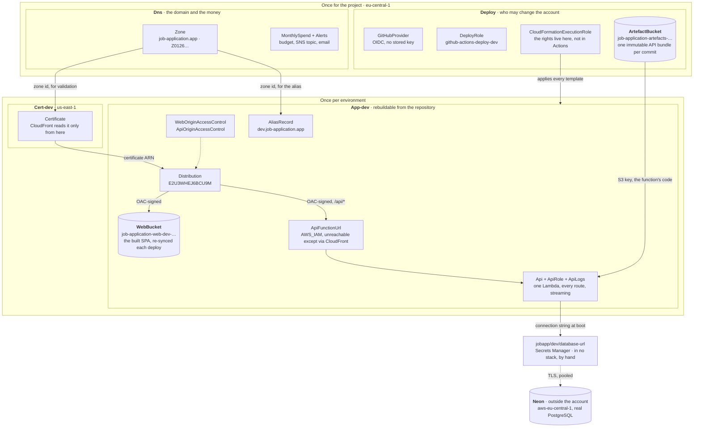
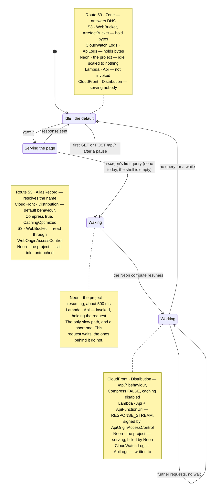
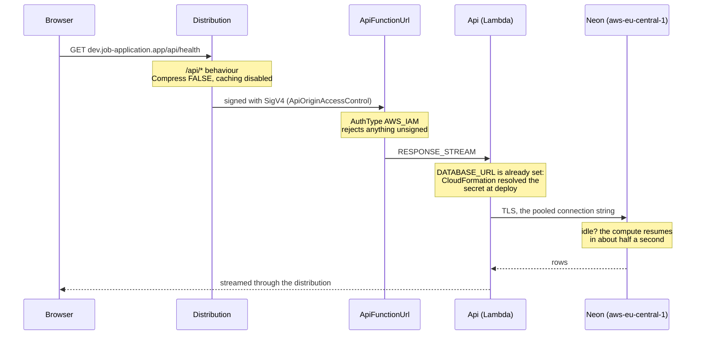
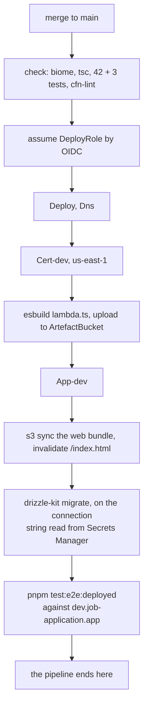

# The infrastructure

What runs in AWS, what each part is for, and which of it is a decision rather than a
default. For an engineer who did not build it and needs to change it, debug it, or
price it.

The templates in this directory are the source: there is no synthesis step and no
generated artefact, so a resource named here is a resource you can find by name in a
`.yaml` beside this file (board `D17`).

## Which environments exist

**One: `dev`.** There is no production.

| Environment | Address                   | Stacks                  | State                                                |
| ----------- | ------------------------- | ----------------------- | ---------------------------------------------------- |
| `dev`       | `dev.job-application.app` | `Cert-dev`, `App-dev`   | the only one deployed                                |
| `prod`      | `job-application.app`     | `Cert-prod`, `App-prod` | **not deployed, and the templates do not yet exist** |

`Deploy` and `Dns` are shared by both and exist once for the project.

Prod is not a different design: it is a second copy of the same two templates, at the
apex instead of a subdomain. The pipeline deploys `dev` on a merge to `main` and `prod`
on a `v*` tag, with the prod job behind a GitHub environment and a required reviewer
(board `D9`). Until someone writes those two templates and pushes a tag, everything
below describes `dev`.

**To read the truth rather than this document**, which drifts the moment anything
changes:

```sh
aws cloudformation describe-stacks --region eu-central-1 --query "Stacks[].{Name:StackName,Status:StackStatus}" --output table
```

## The account and the regions

|             |                                                                 |
| ----------- | --------------------------------------------------------------- |
| Account     | `917993967998`                                                  |
| Region      | `eu-central-1`, Frankfurt (board `D14`)                         |
| Exception   | `Cert-dev` in `us-east-1`                                       |
| Domain      | `job-application.app`, development at `dev.job-application.app` |
| Hosted zone | `Z01268721BDDLWGJVLJS8`                                         |

The region is stated in `bin`-less templates and in the workflow, never taken from
ambient credentials, so a stack cannot deploy wherever a shell happens to point.

**Every stack carries its meaning as tags**, because most of what the account holds is
named by AWS and can never be renamed: a distribution is `E2U3WHEJ6BCU9M`, a hosted zone
`Z01268721BDDLWGJVLJS8`, a certificate a bare uuid. The pipeline passes
`Project=job-application`, `Environment=dev`, `ManagedBy=cloudformation` and a
`Component` naming the stack on every `cloudformation deploy`, and CloudFormation stamps
them onto every resource that supports a tag. It is done there rather than by hand for a
reason learned the hard way: `put-bucket-tagging` replaces the whole tag set and refuses
to touch a bucket carrying CloudFormation’s own `aws:` system tags, so a tag applied from
a laptop either fails or is lost at the next deploy.

`Cert-dev` is not a preference. CloudFront reads its certificate from `us-east-1` and
from nowhere else, whatever region serves the traffic, and a stack lives in one region —
so the certificate is a stack of its own.

## The three constraints everything else follows from

**Idle cost under CHF 10 a month** (`F15`). This is what forbids a NAT gateway
(~CHF 35/month), an RDS proxy, an API Gateway, and always-on database capacity.
`tests/invariants.test.ts` asserts each of those absences, because each was one line of
configuration away from being undone silently.

**Replies must stream.** The chat's answers arrive over server-sent events, which
survives only if nothing between the function and the browser buffers the response.

**Nothing deploys from a laptop.** GitHub Actions holds the only identity that may
change the account, and it is scoped to one repository and one branch.

## The stacks

Four, split by what happens if they are destroyed and by how often they change
(board `D8`).

Dependency graph: which stack needs what from which, and so the order they deploy in.



**There is no data stack** (board `D19`). The state is a Neon project outside the
account, reached with a connection string Secrets Manager holds, so no stack declares a
database and none declares a VPC. `Data-dev` — an Aurora Serverless v2 cluster in a VPC
of its own — was deleted on 2026-09-10 with its sixteen resources, after `App-dev` had
stopped importing from it; the template, its baseline and its invariants went with it
(`S7.7`, `S7.8`).

## The tiers a request passes through

Container diagram: every component that serves a request, from the name to the row, and
which tier it belongs to. Solid arrows are the request; dotted are what a tier needs in
order to do its job.


**Tier 5 is not in the account at all.** That is the unusual seam: the database is a
Neon project in `aws-eu-central-1`, so there is no VPC anywhere in the architecture and
no NAT gateway to avoid. What defends the hop is TLS and the connection string itself,
which names one project's pooler, is held in Secrets Manager and is never in this
repository (`D19`). What is given up is stated rather than discovered: the data
sits with a third party, and the credential is a password where the Aurora cluster had
an identity token minted per connection.

**Nothing skips a tier.** The browser cannot reach `ApiFunctionUrl` — it is `AWS_IAM` and
rejects anything the distribution has not signed. It cannot reach `WebBucket` — the
bucket blocks public access and its policy names one distribution. Both origins are
private, and CloudFront is the only door.

## Every resource

### `Deploy` — who may change the account

| Logical id                    | Type                     | What it is for                                                                                                                                                                                                                                 |
| ----------------------------- | ------------------------ | ---------------------------------------------------------------------------------------------------------------------------------------------------------------------------------------------------------------------------------------------- |
| `GitHubProvider`              | `AWS::IAM::OIDCProvider` | Trusts tokens minted by GitHub Actions. One per URL per account                                                                                                                                                                                |
| `DeployRole`                  | `AWS::IAM::Role`         | `github-actions-deploy-dev`. Assumed by the pipeline; trusts one repository and `refs/heads/main` only                                                                                                                                         |
| `DeployRolePolicy`            | `AWS::IAM::Policy`       | What the pipeline may do. CloudFormation on these four stacks **by name**, `PassRole` on the execution role, the artefact bucket, the web bucket, and `GetSecretValue` on `jobapp/dev/database-url` alone, which is all the migrate step needs |
| `CloudFormationExecutionRole` | `AWS::IAM::Role`         | The rights to **create** resources are held here, not by the pipeline. CloudFormation acts as this role, so a mistake in the workflow reaches only what CloudFormation would have done anyway                                                  |
| `ArtefactBucket`              | `AWS::S3::Bucket`        | Holds the Lambda bundle the pipeline uploads                                                                                                                                                                                                   |

The last two replace CDK's bootstrap (`cdk-hnb659fds-cfn-exec-role` and its asset
bucket), which deleting CDK deleted.

**No application register, and why it was tried.** Resource Explorer has an
`Application` column, filled from an AWS Service Catalog AppRegistry application, and on
2026-09-10 three stacks were changed to declare one. The deploy failed: _"AWS Service
Catalog AppRegistry is in maintenance mode and is no longer available to new customers as
of July 30, 2026"_, a 403 at create time. The resource type is still in CloudFormation's
schema and still in the documentation, so `cfn-lint` passed and nothing local could have
known; only a deploy could. `Deploy` rolled back cleanly and the change was reverted.

What does the job instead is the tags above. `tag:Project=job-application` in Resource
Explorer separates our eleven resources from the thirty AWS creates in every account by
itself — MemoryDB parameter groups, default KMS keys, an Athena workgroup, a default
event bus — which was the point. The `Application` column stays empty, and that is a
cosmetic loss.

### `Dns` — the domain and the spend alarm

| Logical id                | Type                       | What it is for                                       |
| ------------------------- | -------------------------- | ---------------------------------------------------- |
| `Zone`                    | `AWS::Route53::HostedZone` | `job-application.app`. **`DeletionPolicy: Retain`**  |
| `Alerts`                  | `AWS::SNS::Topic`          | Where every alarm reports                            |
| `AlertsEmailSubscription` | `AWS::SNS::Subscription`   | Email. Needs confirming by hand after any recreation |
| `AlertsPolicy`            | `AWS::SNS::TopicPolicy`    | Lets AWS Budgets publish to the topic                |
| `MonthlySpend`            | `AWS::Budgets::Budget`     | USD 20/month. `US7`                                  |

**The zone is the one resource here that can take the product off the internet.** Its
four name servers are typed by hand at the registrar; a replacement zone gets four
different ones and nothing resolves until they are typed in again and propagate. That is
why it is retained, and why `import-runbook.md` exists.

### `Cert-dev` — the certificate

| Logical id    | Type                                   | What it is for                                               |
| ------------- | -------------------------------------- | ------------------------------------------------------------ |
| `Certificate` | `AWS::CertificateManager::Certificate` | `dev.job-application.app`, validated by DNS against the zone |

### `App-dev` — the application

| Logical id                                         | Type                                   | What it is for                                                                                                                                                                                                                                   |
| -------------------------------------------------- | -------------------------------------- | ------------------------------------------------------------------------------------------------------------------------------------------------------------------------------------------------------------------------------------------------ |
| `ApiLogs`                                          | `AWS::Logs::LogGroup`                  | Two weeks' retention                                                                                                                                                                                                                             |
| `ApiRole`                                          | `AWS::IAM::Role`                       | What the function may do: write its own log group, and nothing else. The database is not an AWS resource, so there is no right to grant on it                                                                                                    |
| `Api`                                              | `AWS::Lambda::Function`                | Hono. One function for **every** route. `DATABASE_URL` is a `{{resolve:secretsmanager:...}}` reference CloudFormation reads while it applies the stack, so the function makes no call to read it and a rotated secret arrives on the next deploy |
| `ApiFunctionUrl`                                   | `AWS::Lambda::Url`                     | `AuthType: AWS_IAM`, `InvokeMode: RESPONSE_STREAM`                                                                                                                                                                                               |
| `ApiInvokeFromDistribution`                        | `AWS::Lambda::Permission`              | Lets one distribution, and only that one, invoke the function                                                                                                                                                                                    |
| `WebBucket`, `WebBucketPolicy`                     | `AWS::S3::Bucket`, `::BucketPolicy`    | The Angular bundle. Readable only by the distribution                                                                                                                                                                                            |
| `WebOriginAccessControl`, `ApiOriginAccessControl` | `AWS::CloudFront::OriginAccessControl` | Sign requests to each origin                                                                                                                                                                                                                     |
| `Distribution`                                     | `AWS::CloudFront::Distribution`        | The front door. Maps a bucket's 403 to `/index.html` for deep links, and **only** 403: a 404 from the API passes through as itself (`S9.3`)                                                                                                      |
| `AliasRecord`                                      | `AWS::Route53::RecordSet`              | `dev.job-application.app` at the distribution                                                                                                                                                                                                    |

## What actually runs, and when

Most of what is listed above does not run. It exists — a role, a route table, a policy —
and costs nothing until something uses it. Three groups, and the difference is the whole
cost posture:

|                          | Resources                                                                                               | Cost shape                                                                                                                         |
| ------------------------ | ------------------------------------------------------------------------------------------------------- | ---------------------------------------------------------------------------------------------------------------------------------- |
| **Always there**         | `Zone`, `WebBucket`, `ArtefactBucket`, `ApiLogs`                                                        | A hosted zone is charged by the hour whether or not anything asks for it. Storage is charged by the byte. These are the fixed line |
| **Runs only when asked** | `Api` (Lambda), `Distribution` (CloudFront)                                                             | Per invocation and per request. Nothing at rest                                                                                    |
| **Asleep by default**    | the Neon project                                                                                        | Neon's own free tier, not an AWS line. It scales to nothing when idle and wakes in roughly half a second                           |
| **Costs nothing, ever**  | Every `AWS::IAM::*`, both `OriginAccessControl`s, `ApiInvokeFromDistribution`, `MonthlySpend`, `Alerts` | Configuration. It has no runtime                                                                                                   |

So on a quiet day the account runs **nothing**: the function is not invoked and the
distribution serves nobody. What is left is a hosted zone and a few megabytes of S3,
which is what makes `F15`'s figure achievable.

State machine: what the account is doing at any moment, and what moves it between.



**The transition worth knowing is `Page --> Waking`, and that it is not automatic.**
Loading the page costs a CloudFront request and an S3 read and nothing else; only a call
to `/api/*` reaches the function, and only a query reaches the database. So a visitor who
looks and leaves never wakes it. Today the page is an empty shell that calls nothing, so
the only thing that reaches `/api/*` is the health check below.

**`Waking` is barely a wait any more.** Neon's compute resumes in roughly half a second,
where the paused Aurora Serverless v2 cluster it replaced took seconds and the request
that triggered it paid for all of them (`D19`). That is most of why the board moved: the
schema, the `pgEnum` and drizzle-kit work untouched on real PostgreSQL, and the wait stops
being something a failure table has to price.

One thing costs while idle and is worth knowing by name: the **hosted zone**, which is
unavoidable because it is the domain. It is the whole fixed line.

`MonthlySpend` watches all of it and mails `Alerts` at the threshold, which is `US7`.

## How a request reaches the database

Sequence: what a read touches, and where the two properties that make streaming work are enforced.



**Two properties this diagram exists to make visible.**

`Compress: false` on the `/api/*` behaviour. CloudFront compression buffers a response to
its end before sending it, which turns a stream into a single late reply. The default
behaviour serving the web bundle has `Compress: true`, where it is pure gain.

A **write** carries `x-amz-content-sha256`. Origin access control signs the request that
reaches the function and the signature covers a hash of the body, which CloudFront does
not compute — the sender states it. `apps/web/src/app/lib/api.ts` does this for every
write, and anything calling the deployed API from outside the page must do the same.
Nothing writes today — the health route only reads — so the header is exercised by
`apps/web`'s own test rather than by a route, and the first write to forget it is a 403
in the cloud and nothing at all locally.

A third property is not on the diagram because it shows in what does _not_ happen. The
distribution's `CustomErrorResponses` map a bucket's 403 — what a missing key answers
behind origin access control, and so what every deep link answers — to `/index.html`
with status 200, so the router can resolve the path in the browser. They are
distribution-wide and cannot be scoped to one behaviour, so they used to map 404 as
well, and an unknown API path came back as the page with status 200. Only 403
is mapped now (`S9.3`), and `e2e/health.spec.ts` asks the deployed distribution about
both halves of it on every merge: the API answers 404 for what it cannot find and never a bare 403,
so its errors pass through as themselves. The residual is written beside the mapping in
`App-dev.yaml`: an unsigned request refused by the function URL is a 403, and that one
still reads as the page, which is why the header above is not optional.

The API holds up its own half of that bargain in `app.ts`, which answers an unmatched
path with `{ "error": "no such route" }` as JSON. Hono's own default is `text/plain`, and
it was invisible for as long as every `/api` path belonged to a handler writing its own
JSON error; removing the run routes exposed it, and the pipeline's deployed check found
it within a minute of becoming a real step, on the very merge that added it. A client that
parses every answer the same way should not meet a syntax error at the one moment it is
already lost.

## How code reaches the account

Phasing: the order a merge is applied in, and where it stops.



Two steps exist because the L2 constructs that did them are gone: `esbuild` replaced
`NodejsFunction`'s bundling, and `s3 sync` replaced `BucketDeployment`.

**The pipeline checks what it deployed** (board `D20`, reversing the amendment `D9`
carried as a comment it never made real). After the migration it runs
`pnpm test:e2e:deployed` against the development address, and a failing check fails the
job. CloudFormation reporting success is not the same as the environment working: a
deploy that breaks DNS, the certificate or the distribution used to be reported
successful until somebody looked.

What made that step unrunnable before was what it drove — the run skeleton, so every
merge wrote rows into the domain tables, which on prod would mean writing product data
as a side effect of shipping. **The check is the health route now**, which writes
nothing: `e2e/health.spec.ts` asks the deployed API for `/api/health` and gets the
database's own answer to `select version()` (a deploy happened and a real database is
behind it), then asks for an unknown API path and a deep link and gets 404 JSON and 200
HTML (the distribution keeps the two apart); `e2e/health-stream.spec.ts` reads
`/api/health/stream` raw and sees beats arriving one at a time (nothing in between
buffers) and a stream held past the origin read timeout still open (the connection
survives the distribution). Both drive the API with Playwright's `request` fixture or
the platform's `fetch`, and neither opens a page: the web app is an empty shell until
the first real screen.

The `run` and `run_unit` skeleton these questions used to be asked through is at the tag
**`foundation-skeleton`**; `main` carries nothing that nothing calls (`D20`).

**Migrations run after the application**, so new code must tolerate the old schema for
the minute between them, and a failed migration leaves working code with the deploy
already reported successful. Recovering is re-tagging, not a rollback.

**One deploy at a time, never cancelled.** A cancelled CloudFormation update leaves a
stack in a state the next run has to clean up by hand.

## What is not here

**No prod.** `Cert-prod` and `App-prod` are a second copy of the same two templates;
`Deploy` and `Dns` are already shared. The pipeline deploys dev on a merge and
prod on a tag, and the prod job sits behind a GitHub environment with a required
reviewer.

**No queue and no worker** (board `D7`). A long AI step runs on the streaming route and
writes each unit of its work as that unit finishes, so a cut connection loses only the
unit in flight.

**No `CDKToolkit`, and no VPC anywhere.** Both were true of the account rather than of
the templates, and both were cleaned out on 2026-09-10. CDK’s bootstrap went with its two
asset buckets, its container registry, its version parameter and its ten roles — the
buckets needed their object _versions_ deleted first, since the bootstrap sets
`DeletionPolicy: Retain` and the stack delete only orphans them. The default VPC AWS
creates in every region went too, in both `eu-central-1` and `us-east-1`, with its
subnets, gateway, route tables, ACL and security group. `describe-vpcs` now answers
nothing in either region, which is the strongest statement of `F10` there is: the
architecture has no private network because the account has none.

## Two failures worth not repeating

Both were latent from the first day and surfaced only when something first tried to use
them. Neither came from the move off CDK — the CDK templates carried the same defects.

**GitHub's OIDC subject now carries immutable ids.** A trust policy matching
`repo:OWNER/REPO:ref:refs/heads/main` is refused, because the claim reads
`repo:OWNER@<ownerId>/REPO@<repoId>:ref:refs/heads/main`. The policy looks correct and
`StringEquals` is exact. **CloudTrail's record of the claim is the only place the
difference is visible** — for an OIDC denial, go there before auditing the policy.

**EC2 takes a security group rule description only from
`a-zA-Z0-9. _-:/()#,@[]+=&;{}!$*`.** An apostrophe rejects the whole stack, twelve
minutes into Aurora provisioning. Valid YAML, valid CloudFormation, `cfn-lint` clean:
only EC2's resource handler knows the rule. `tests/invariants.test.ts` asserts the
character set now.

## Changing any of this

Templates are applied by the pipeline, never from a laptop. The exceptions are named and
few: the original bootstrap, and step 5 of `import-runbook.md`, both of which create the
identity the pipeline needs in order to exist.

Before changing a template, know that `tests/invariants.test.ts` will refuse a change
that undoes a foundation decision. It is the permanent half of what `infra/tests` once
held. The other half, `parity.test.ts`, compared every template against the CDK synth it
was converted from; it was deleted on 2026-09-10 (`ID53`) once the pipeline had deployed
green, because its oracle was a frozen 1,847-line snapshot from a tool no longer in this
repository, so every legitimate future change could only lengthen its list of declared
exceptions. It did its job first: seen failing twice, it caught real omissions and forced
every difference from CDK to be justified in writing.
