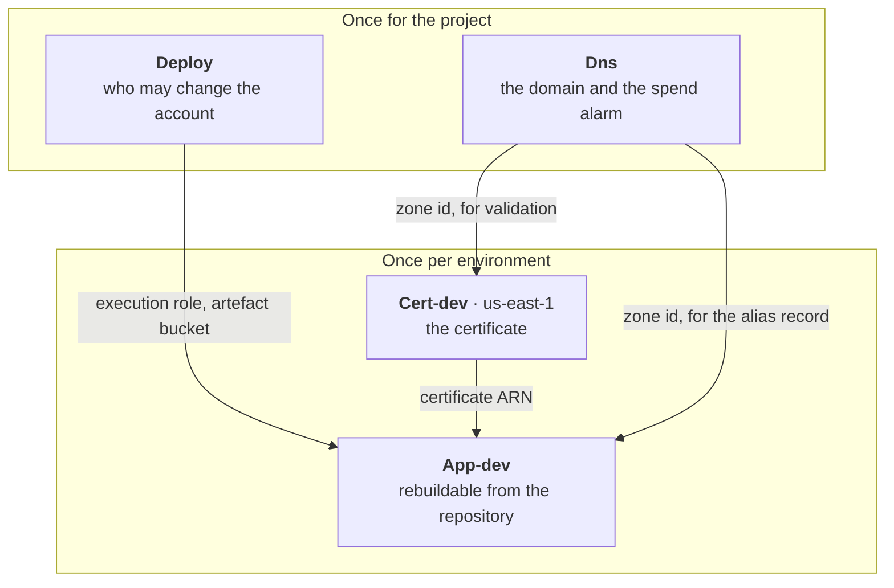
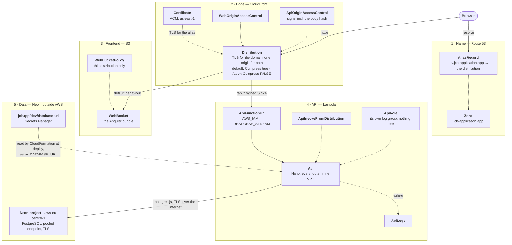
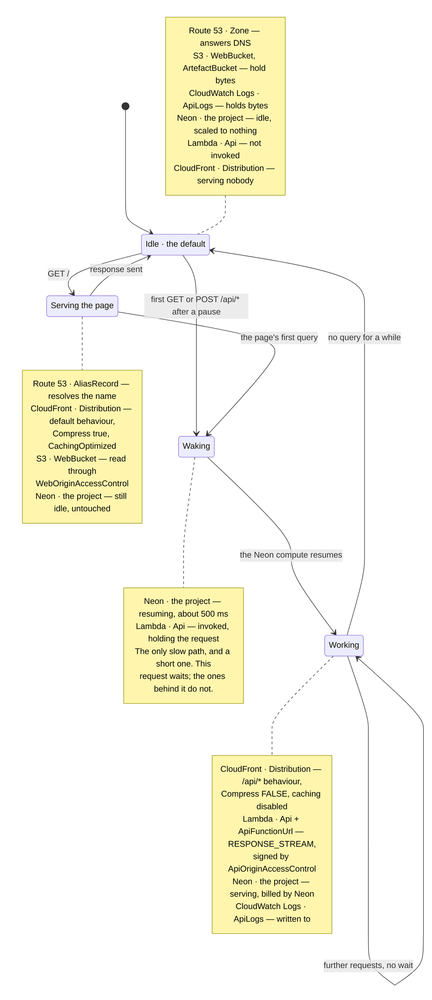
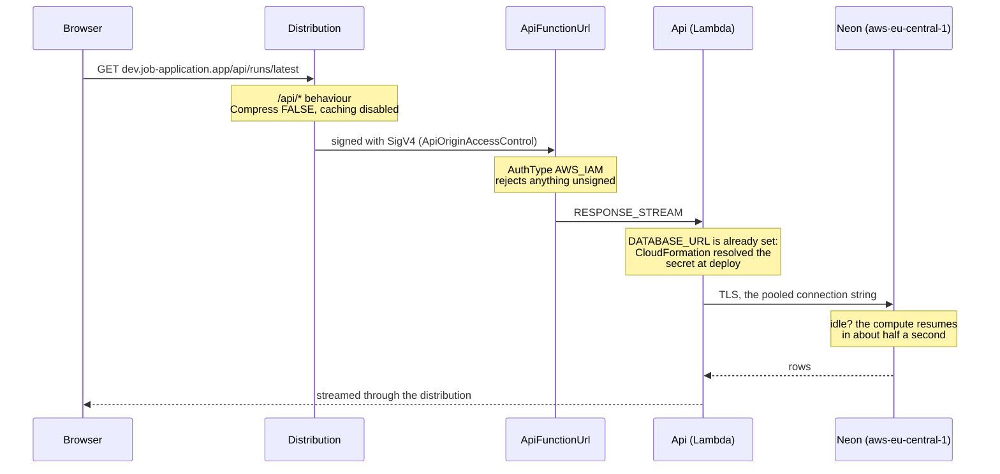
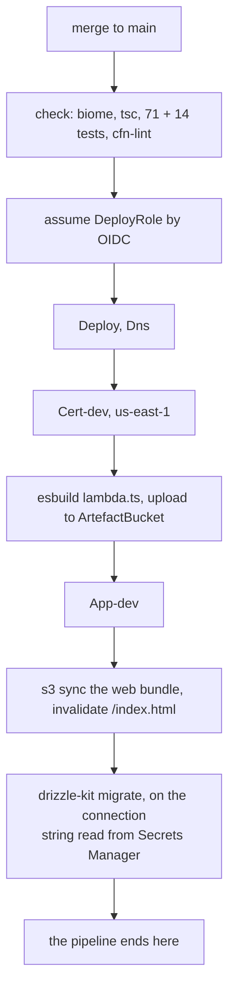

# The infrastructure

What runs in AWS, what each part is for, and which of it is a decision rather than a
default. For an engineer who did not build it and needs to change it, debug it, or
price it.

The templates in this directory are the source: there is no synthesis step and no
generated artefact, so a resource named here is a resource you can find by name in a
`.yaml` beside this file (board `D17`).

## Which environments exist

**One: `dev`.** There is no production.

| Environment | Address | Stacks | State |
|---|---|---|---|
| `dev` | `dev.job-application.app` | `Cert-dev`, `App-dev` | the only one deployed |
| `prod` | `job-application.app` | `Cert-prod`, `App-prod` | **not deployed, and the templates do not yet exist** |

`Deploy` and `Dns` are shared by both and exist once for the project.

Prod is not a different design: it is a second copy of the same two templates, at the
apex instead of a subdomain. The pipeline deploys `dev` on a merge to `main` and `prod`
on a `v*` tag, with the prod job behind a GitHub environment and a required reviewer
(board `D9`). Until someone writes those two templates and pushes a tag, everything
below describes `dev`.

**To read the truth rather than this document**, which drifts the moment anything
changes:

```sh
aws cloudformation describe-stacks --region eu-central-1 --query "Stacks[].{Name:StackName,Status:StackStatus}" --output table
```

## The account and the regions

| | |
|---|---|
| Account | `917993967998` |
| Region | `eu-central-1`, Frankfurt (board `D14`) |
| Exception | `Cert-dev` in `us-east-1` |
| Domain | `job-application.app`, development at `dev.job-application.app` |
| Hosted zone | `Z01268721BDDLWGJVLJS8` |

The region is stated in `bin`-less templates and in the workflow, never taken from
ambient credentials, so a stack cannot deploy wherever a shell happens to point.

`Cert-dev` is not a preference. CloudFront reads its certificate from `us-east-1` and
from nowhere else, whatever region serves the traffic, and a stack lives in one region —
so the certificate is a stack of its own.

## The three constraints everything else follows from

**Idle cost under CHF 10 a month** (`F15`, rule 17). This is what forbids a NAT gateway
(~CHF 35/month), an RDS proxy, an API Gateway, and always-on database capacity. Twelve
tests in `tests/invariants.test.ts` assert each of those absences, because each was one
line of configuration away from being undone silently.

**Replies must stream.** The chat's answers arrive over server-sent events, which
survives only if nothing between the function and the browser buffers the response.

**Nothing deploys from a laptop.** GitHub Actions holds the only identity that may
change the account, and it is scoped to one repository and one branch.

## The stacks

Four, split by what happens if they are destroyed and by how often they change
(board `D8`).

Dependency graph: which stack needs what from which, and so the order they deploy in.



**There is no data stack** (board `D19`). The state is a Neon project outside the
account, reached with a connection string Secrets Manager holds, so no stack declares a
database and none declares a VPC. `Data-dev` — an Aurora Serverless v2 cluster in a VPC
of its own — was deleted on 2026-09-10 with its sixteen resources, after `App-dev` had
stopped importing from it; the template, its parity baseline and its invariants went with
it (`S7.7`, `S7.8`).

## The tiers a request passes through

Container diagram: every component that serves a request, from the name to the row, and
which tier it belongs to. Solid arrows are the request; dotted are what a tier needs in
order to do its job.



**Tier 5 is not in the account at all.** That is the unusual seam: the database is a
Neon project in `aws-eu-central-1`, so there is no VPC anywhere in the architecture and
no NAT gateway to avoid. What defends the hop is TLS and the connection string itself,
which names one project's pooler, is held in Secrets Manager and is never in this
repository (`D19`, rule 12). What is given up is stated rather than discovered: the data
sits with a third party, and the credential is a password where the Aurora cluster had
an identity token minted per connection.

**Nothing skips a tier.** The browser cannot reach `ApiFunctionUrl` — it is `AWS_IAM` and
rejects anything the distribution has not signed. It cannot reach `WebBucket` — the
bucket blocks public access and its policy names one distribution. Both origins are
private, and CloudFront is the only door.

## Every resource

### `Deploy` — who may change the account

| Logical id | Type | What it is for |
|---|---|---|
| `GitHubProvider` | `AWS::IAM::OIDCProvider` | Trusts tokens minted by GitHub Actions. One per URL per account |
| `DeployRole` | `AWS::IAM::Role` | `github-actions-deploy-dev`. Assumed by the pipeline; trusts one repository and `refs/heads/main` only |
| `DeployRolePolicy` | `AWS::IAM::Policy` | What the pipeline may do. CloudFormation on these four stacks **by name**, `PassRole` on the execution role, the artefact bucket, the web bucket, and `GetSecretValue` on `jobapp/dev/database-url` alone, which is all the migrate step needs |
| `CloudFormationExecutionRole` | `AWS::IAM::Role` | The rights to **create** resources are held here, not by the pipeline. CloudFormation acts as this role, so a mistake in the workflow reaches only what CloudFormation would have done anyway |
| `ArtefactBucket` | `AWS::S3::Bucket` | Holds the Lambda bundle the pipeline uploads |

The last two replace CDK's bootstrap (`cdk-hnb659fds-cfn-exec-role` and its asset
bucket), which deleting CDK deleted.

### `Dns` — the domain and the spend alarm

| Logical id | Type | What it is for |
|---|---|---|
| `Zone` | `AWS::Route53::HostedZone` | `job-application.app`. **`DeletionPolicy: Retain`** |
| `Alerts` | `AWS::SNS::Topic` | Where every alarm reports |
| `AlertsEmailSubscription` | `AWS::SNS::Subscription` | Email. Needs confirming by hand after any recreation |
| `AlertsPolicy` | `AWS::SNS::TopicPolicy` | Lets AWS Budgets publish to the topic |
| `MonthlySpend` | `AWS::Budgets::Budget` | USD 20/month. `US7` |

**The zone is the one resource here that can take the product off the internet.** Its
four name servers are typed by hand at the registrar; a replacement zone gets four
different ones and nothing resolves until they are typed in again and propagate. That is
why it is retained, and why `import-runbook.md` exists.

### `Cert-dev` — the certificate

| Logical id | Type | What it is for |
|---|---|---|
| `Certificate` | `AWS::CertificateManager::Certificate` | `dev.job-application.app`, validated by DNS against the zone |

### `App-dev` — the application

| Logical id | Type | What it is for |
|---|---|---|
| `ApiLogs` | `AWS::Logs::LogGroup` | Two weeks' retention |
| `ApiRole` | `AWS::IAM::Role` | What the function may do: write its own log group, and nothing else. The database is not an AWS resource, so there is no right to grant on it |
| `Api` | `AWS::Lambda::Function` | Hono. One function for **every** route. `DATABASE_URL` is a `{{resolve:secretsmanager:...}}` reference CloudFormation reads while it applies the stack, so the function makes no call to read it and a rotated secret arrives on the next deploy |
| `ApiFunctionUrl` | `AWS::Lambda::Url` | `AuthType: AWS_IAM`, `InvokeMode: RESPONSE_STREAM` |
| `ApiInvokeFromDistribution` | `AWS::Lambda::Permission` | Lets one distribution, and only that one, invoke the function |
| `WebBucket`, `WebBucketPolicy` | `AWS::S3::Bucket`, `::BucketPolicy` | The Angular bundle. Readable only by the distribution |
| `WebOriginAccessControl`, `ApiOriginAccessControl` | `AWS::CloudFront::OriginAccessControl` | Sign requests to each origin |
| `Distribution` | `AWS::CloudFront::Distribution` | The front door |
| `AliasRecord` | `AWS::Route53::RecordSet` | `dev.job-application.app` at the distribution |

## What actually runs, and when

Most of what is listed above does not run. It exists — a role, a route table, a policy —
and costs nothing until something uses it. Three groups, and the difference is the whole
cost posture:

| | Resources | Cost shape |
|---|---|---|
| **Always there** | `Zone`, `WebBucket`, `ArtefactBucket`, `ApiLogs` | A hosted zone is charged by the hour whether or not anything asks for it. Storage is charged by the byte. These are the fixed line |
| **Runs only when asked** | `Api` (Lambda), `Distribution` (CloudFront) | Per invocation and per request. Nothing at rest |
| **Asleep by default** | the Neon project | Neon's own free tier, not an AWS line. It scales to nothing when idle and wakes in roughly half a second |
| **Costs nothing, ever** | Every `AWS::IAM::*`, both `OriginAccessControl`s, `ApiInvokeFromDistribution`, `MonthlySpend`, `Alerts` | Configuration. It has no runtime |

So on a quiet day the account runs **nothing**: the function is not invoked and the
distribution serves nobody. What is left is a hosted zone and a few megabytes of S3,
which is what makes `F15`'s figure achievable.

State machine: what the account is doing at any moment, and what moves it between.



**The transition worth knowing is `Page --> Waking`, and that it is not automatic.**
Loading the page costs a CloudFront request and an S3 read and nothing else; only a call
to `/api/*` reaches the function, and only a query reaches the database. So a visitor who
looks and leaves never wakes it.

**`Waking` is barely a wait any more.** Neon's compute resumes in roughly half a second,
where the paused Aurora Serverless v2 cluster it replaced took seconds and the request
that triggered it paid for all of them (`D19`). That is most of why the board moved: the
schema, the `pgEnum` and drizzle-kit work untouched on real PostgreSQL, and the wait stops
being something a failure table has to price.

One thing costs while idle and is worth knowing by name: the **hosted zone**, which is
unavoidable because it is the domain. It is the whole fixed line.

`MonthlySpend` watches all of it and mails `Alerts` at the threshold, which is `US7`.

## How a request reaches the database

Sequence: what a read touches, and where the two properties that make streaming work are enforced.



**Two properties this diagram exists to make visible.**

`Compress: false` on the `/api/*` behaviour. CloudFront compression buffers a response to
its end before sending it, which turns a stream into a single late reply. The default
behaviour serving the web bundle has `Compress: true`, where it is pure gain.

A **write** carries `x-amz-content-sha256`. Origin access control signs the request that
reaches the function and the signature covers a hash of the body, which CloudFront does
not compute — the sender states it. `apps/web/src/app/lib/api.ts` does this for every
write, and anything calling the deployed API from outside the page must do the same.

## How code reaches the account

Phasing: the order a merge is applied in, and where it stops.



Two steps exist because the L2 constructs that did them are gone: `esbuild` replaced
`NodejsFunction`'s bundling, and `s3 sync` replaced `BucketDeployment`.

**The pipeline ships and does not judge** (board `D9` as amended, `ID48`). It ends at the
migration. Whether the feature works is the operator check of `D3`, which a person runs
against the deployed address. The consequence, accepted: CloudFormation reporting success
is not the same as the environment working, so a deploy that breaks DNS, the certificate
or the distribution is reported successful until somebody looks.

**Migrations run after the application**, so new code must tolerate the old schema for
the minute between them, and a failed migration leaves working code with the deploy
already reported successful. Recovering is re-tagging, not a rollback.

**One deploy at a time, never cancelled.** A cancelled CloudFormation update leaves a
stack in a state the next run has to clean up by hand.

## What is not here

**No prod.** `Cert-prod`, `Data-prod` and `App-prod` are a second copy of the same three
templates; `Deploy` and `Dns` are already shared. The pipeline deploys dev on a merge and
prod on a tag, and the prod job sits behind a GitHub environment with a required
reviewer.

**No queue and no worker** (board `D7`). A long AI step runs on the streaming route and
writes each unit of its work as that unit finishes, so a cut connection loses only the
unit in flight.

**No `CDKToolkit`.** The stack of that name still stands in the account and nothing uses
it; it is CDK's bootstrap, left from before the conversion.

## Two failures worth not repeating

Both were latent from the first day and surfaced only when something first tried to use
them. Neither came from the move off CDK — the CDK templates carried the same defects.

**GitHub's OIDC subject now carries immutable ids.** A trust policy matching
`repo:OWNER/REPO:ref:refs/heads/main` is refused, because the claim reads
`repo:OWNER@<ownerId>/REPO@<repoId>:ref:refs/heads/main`. The policy looks correct and
`StringEquals` is exact. **CloudTrail's record of the claim is the only place the
difference is visible** — for an OIDC denial, go there before auditing the policy.

**EC2 takes a security group rule description only from
`a-zA-Z0-9. _-:/()#,@[]+=&;{}!$*`.** An apostrophe rejects the whole stack, twelve
minutes into Aurora provisioning. Valid YAML, valid CloudFormation, `cfn-lint` clean:
only EC2's resource handler knows the rule. `tests/invariants.test.ts` asserts the
character set now.

## Changing any of this

Templates are applied by the pipeline, never from a laptop. The exceptions are named and
few: the original bootstrap, and step 5 of `import-runbook.md`, both of which create the
identity the pipeline needs in order to exist.

Before changing a template, know that `tests/invariants.test.ts` will refuse a change
that undoes a foundation decision, and `tests/parity.test.ts` will refuse any difference
from what CDK produced that is not declared with its reason. The second is a migration
check and is expected to retire once the conversion has proven itself (`ID53`); the first
is permanent.
